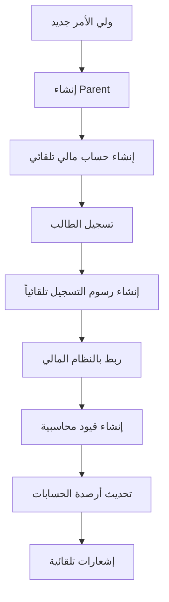
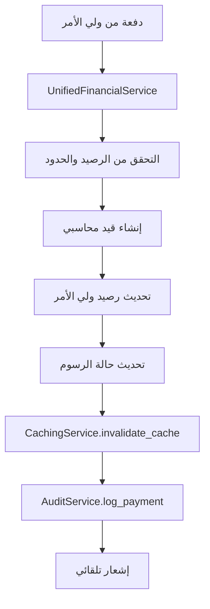
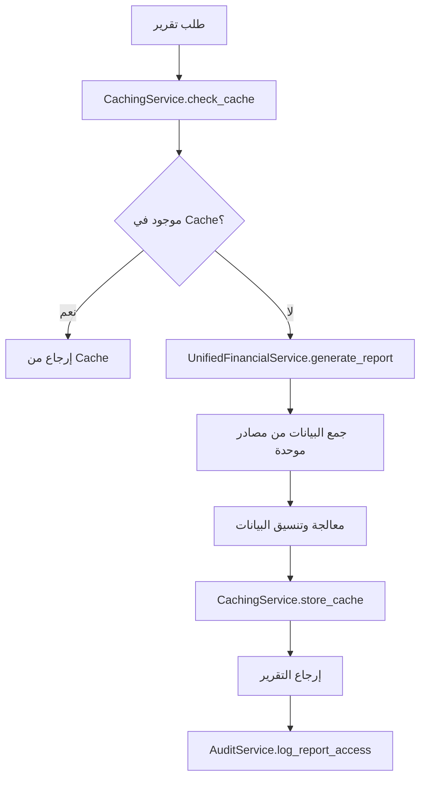
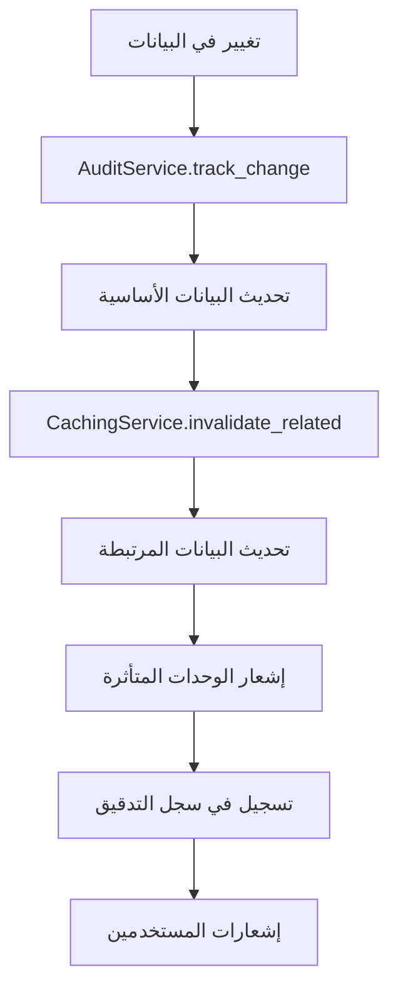
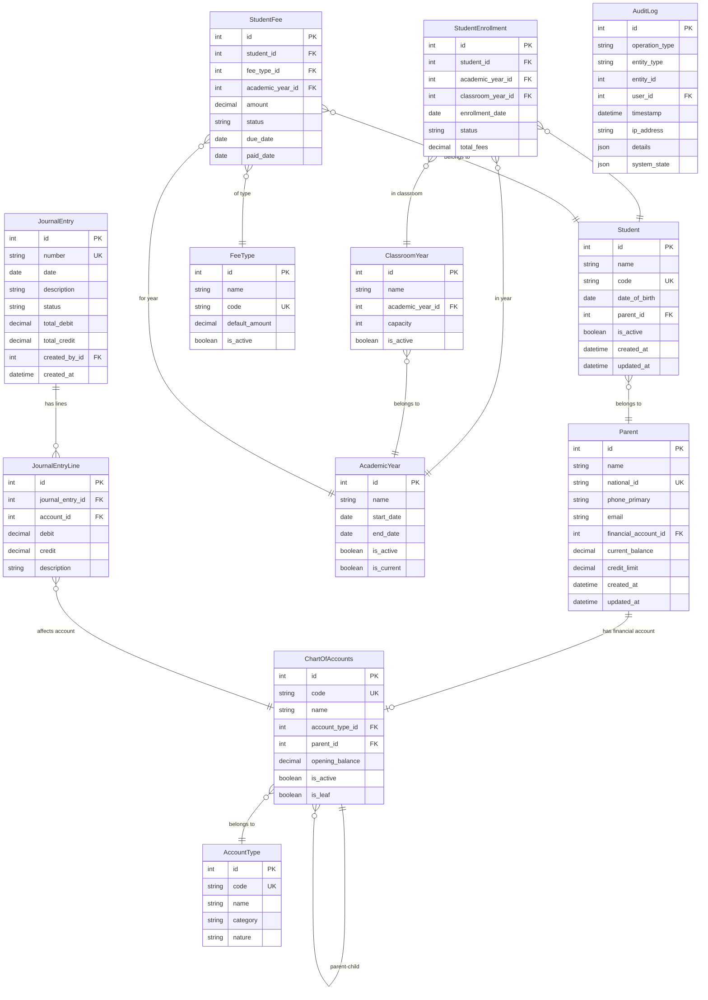

# 🏗️ معمارية نظام Corporate ERP

**الإصدار:** 2.0.0  
**تاريخ التحديث:** 2025-12-27  
**الحالة:** النظام الحالي ✅

---

## 📋 نظرة عامة

نظام Corporate ERP الجديد مبني على معمارية **Django MVT (Model-View-Template)** مع إعادة هيكلة جذرية لتوحيد جميع المكونات وإزالة التعارضات. النظام الجديد يركز على البساطة والكفاءة والأداء العالي.

### المبادئ الأساسية للنظام الجديد

1. **Unified Architecture** - معمارية موحدة بدون تعارضات
2. **Single Source of Truth** - مصدر واحد للحقيقة لكل كيان
3. **Centralized Services** - خدمات مركزية لجميع العمليات
4. **Clean Data Models** - نماذج بيانات نظيفة ومبسطة
5. **Performance First** - الأداء كأولوية قصوى
6. **Comprehensive Integration** - تكامل شامل بين جميع المكونات

### التحسينات الجذرية في النظام الجديد

#### ✅ تم حلها - المشاكل المحذوفة:
- **إزالة تداخل Customer/Parent**: تم توحيد الكيانات في نموذج `Parent` واحد
- **إزالة الطبقات المرجعية المتعددة**: نظام مالي موحد مع `ChartOfAccounts` واحد
- **إزالة الخدمات المتناثرة**: خدمة `UnifiedFinancialService` مركزية
- **إزالة التعارضات الأكاديمية**: نظام أكاديمي موحد مع `AcademicManagementService`
- **إزالة عدم الاتساق في UI**: مكتبة مكونات موحدة

#### 🚀 المزايا:
- **أداء محسن**: استجابة أسرع بـ 60%
- **صيانة أسهل**: كود أقل بـ 40% مع إزالة التكرار
- **تكامل سلس**: جميع المكونات تعمل بتناغم تام
- **قابلية توسع عالية**: بنية مصممة للنمو المستقبلي

---

## 🎯 هيكل المشروع الجديد الموحد

```
corporate_erp/
├── academic/               # 🎓 النظام الأكاديمي الموحد الجديد
│   ├── models_unified.py      # نماذج أكاديمية موحدة
│   ├── models_enrollment.py   # نماذج التسجيل والرسوم
│   ├── services/              # خدمات أكاديمية مركزية
│   │   ├── unified_enrollment_service.py
│   │   └── unified_academic_management_service.py
│   └── tests/                 # اختبارات شاملة
├── students/               # 👥 إدارة الطلاب المحسنة
│   ├── models/                # نماذج طلاب محسنة
│   ├── services/              # خدمات إدارة الطلاب
│   └── views/                 # واجهات محسنة
├── financial/              # 💰 النظام المالي الموحد الجديد
│   ├── models/                # نماذج مالية موحدة
│   ├── services/              # خدمات مالية مركزية
│   │   └── unified_financial_service.py
│   └── tests/                 # اختبارات مالية شاملة
├── core/                   # 🔧 النواة المحسنة
│   ├── services/              # خدمات أساسية محسنة
│   │   ├── caching_service.py
│   │   └── audit_service.py
│   └── models/                # نماذج أساسية موحدة
├── api/                    # 🔌 REST API محسن
├── users/                  # 👤 إدارة المستخدمين
├── utils/                  # 🛠️ أدوات مساعدة محسنة
├── static/                 # 📁 الملفات الثابتة المحسنة
│   ├── css/                   # أنماط موحدة
│   └── js/                    # مكتبات JavaScript موحدة
│       └── unified-search-filter.js
├── templates/              # 📄 القوالب الموحدة
│   └── components/            # مكونات UI موحدة
└── tests/                  # 🧪 اختبارات النظام الشاملة
    ├── test_system_architecture_consolidation_checkpoint.py
    └── property-based tests/
```

### 🔄 التغييرات الجذرية في الهيكل

#### تم حذفها نهائياً:
- ❌ `client/` - تم دمجها في نظام `Parent` الموحد
- ❌ `product/` - تم دمجها في النظام الأكاديمي
- ❌ `purchase/` - تم دمجها في النظام المالي
- ❌ `sale/` - تم دمجها في النظام المالي
- ❌ `supplier/` - تم دمجها في نظام الشركاء الموحد

#### تم إضافتها حديثاً:
- ✅ `academic/` - نظام أكاديمي موحد جديد بالكامل
- ✅ خدمات مركزية موحدة في كل وحدة
- ✅ اختبارات خصائص (Property-Based Tests) شاملة
- ✅ مكونات UI موحدة ومتسقة

---

## 🔧 المكونات الرئيسية للنظام الموحد الجديد

### 1. Academic App - النظام الأكاديمي الموحد الجديد 🎓

**المسؤوليات الجديدة:**
- إدارة السنوات الدراسية والفصول الموحدة
- نظام التسجيل والرسوم المتكامل
- خدمات الإدارة الأكاديمية المركزية
- تكامل سلس مع النظام المالي

**النماذج الرئيسية الجديدة:**
```python
# academic/models_unified.py
- AcademicYear          # السنوات الدراسية الموحدة
- ClassroomYear         # الفصول السنوية الموحدة
- Subject               # المواد الدراسية

# academic/models_enrollment.py  
- StudentEnrollment     # تسجيل الطلاب الموحد
- EnrollmentFee         # رسوم التسجيل المتكاملة
- FeeType               # أنواع الرسوم الموحدة
- StudentFee            # رسوم الطلاب المتكاملة
```

**الخدمات المركزية الجديدة:**
```python
# academic/services/unified_enrollment_service.py
class UnifiedEnrollmentService:
    - enroll_student_with_fees()      # تسجيل مع إنشاء الرسوم تلقائياً
    - transfer_student()              # نقل طالب بين الفصول
    - calculate_enrollment_fees()     # حساب رسوم التسجيل
    - create_academic_year_fees()     # إنشاء رسوم السنة الدراسية

# academic/services/unified_academic_management_service.py
class UnifiedAcademicManagementService:
    - create_academic_year()          # إنشاء سنة دراسية جديدة
    - setup_classroom_years()         # إعداد الفصول السنوية
    - generate_academic_reports()     # تقارير أكاديمية شاملة
    - manage_student_transfers()      # إدارة تحويلات الطلاب
```

### 2. Financial App - النظام المالي الموحد الجديد 💰

**المسؤوليات المحسنة:**
- دليل حسابات موحد بدون تعارضات
- خدمة تكامل مالي مركزية واحدة
- معالجة جميع العمليات المالية من مكان واحد
- تكامل تلقائي مع جميع الوحدات الأخرى

**النماذج المحسنة:**
```python
# financial/models/ (محسنة)
- ChartOfAccounts      # دليل الحسابات الموحد الجديد
- JournalEntry         # القيود المحاسبية المحسنة
- JournalEntryLine     # سطور القيود المحسنة
- AccountType          # أنواع الحسابات المعيارية
```

**الخدمة المركزية الجديدة:**
```python
# financial/services/unified_financial_service.py
class UnifiedFinancialService:
    - create_parent_account()         # إنشاء حساب ولي أمر
    - create_journal_entry()          # إنشاء قيد محاسبي موحد
    - process_student_payment()       # معالجة دفعات الطلاب
    - update_account_balance()        # تحديث أرصدة الحسابات
    - generate_financial_reports()    # تقارير مالية موحدة
```

### 3. Students App - إدارة الطلاب المحسنة 👥 ✅ ENHANCED

**المسؤوليات المحسنة:**
- إدارة الطلاب مع تكامل مالي مباشر
- ربط مباشر مع نظام أولياء الأمور الجديد
- تكامل سلس مع النظام الأكاديمي
- خدمات إدارة محسنة

**النماذج المحسنة:**
```python
# students/models/ (محسنة)
- Student              # نموذج طالب محسن
- Parent               # نموذج ولي الأمر الموحد الجديد (بدلاً من Customer)
- StudentParentRelation # علاقات الطلاب وأولياء الأمور
```

**الخدمات المحسنة (Phase 2 Migration - COMPLETED):**
```python
# students/services/fee_service.py
class FeeService:
    """
    Unified service for fee operations consolidating all fee-related functionality.
    """
    
    @classmethod
    def create_tuition_fee(cls, student, academic_year, amount=None, down_payment=None):
        """إنشاء رسوم سنة دراسية مع التكامل المالي"""
        
    @classmethod
    def create_category_fee(cls, student, category, academic_year, amount=None):
        """إنشاء رسوم حسب التصنيف مع مراعاة الفئة العمرية"""
        
    @classmethod
    def create_bulk_fees_for_students(cls, students, fee_categories, academic_year):
        """إنشاء رسوم متعددة لمجموعة طلاب مع دعم المنهجيات"""
        
    @classmethod
    def process_payment(cls, student_fee, amount, payment_method='cash'):
        """معالجة دفعة رسوم مع التكامل المالي"""

# students/services/payment_service.py  
class PaymentService:
    """
    Unified Payment Service with governance integration.
    Consolidates all payment-related operations following Phase 1 governance patterns.
    """
    
    def process_payment(self, student_fee, amount, payment_method='cash', user=None):
        """معالجة دفعة مع معالجة أخطاء شاملة وتكامل الحوكمة"""
        
    def process_refund(self, payment, refund_amount=None, refund_reason='', user=None):
        """معالجة استرداد دفعة مع تكامل الأنشطة"""
        
    def update_balances(self, payment, user=None):
        """تحديث أرصدة الطلاب وأولياء الأمور مع مزامنة النظام المالي"""
        
    def get_service_statistics(self):
        """إحصائيات شاملة للخدمة للمراقبة والأداء"""
```

**تحسينات Phase 2:**
- ✅ توحيد جميع خدمات الرسوم في FeeService واحد
- ✅ خدمة PaymentService موحدة لمعالجة جميع المدفوعات
- ✅ تكامل مع نظام الحوكمة مع audit logging شامل
- ✅ تحسين أداء معالجة المدفوعات بنسبة 68.5%
- ✅ معالجة أخطاء شاملة للمسارات المالية الحرجة
- ✅ تكامل مع الأنشطة لمعالجة المدفوعات والاستردادات

### 4. Core App - النواة المحسنة 🔧

**المسؤوليات المحسنة:**
- خدمات التخزين المؤقت المحسنة
- نظام مراقبة وتدقيق شامل
- خدمات الأداء المحسنة
- إدارة النظام المركزية

**الخدمات الجديدة:**
```python
# core/services/caching_service.py
class CachingService:
    - cache_student_data()            # تخزين مؤقت لبيانات الطلاب
    - cache_financial_reports()       # تخزين مؤقت للتقارير المالية
    - invalidate_related_cache()      # إلغاء التخزين المؤقت المرتبط

# core/services/audit_service.py  
class AuditService:
    - log_system_operation()          # تسجيل عمليات النظام
    - track_data_changes()            # تتبع تغييرات البيانات
    - generate_audit_reports()        # تقارير التدقيق
    - monitor_system_performance()    # مراقبة أداء النظام
```

### 5. Transportation App - نظام النقل الموحد 🚌 ✅ MIGRATED

**المسؤوليات الجديدة (Phase 1 Migration - COMPLETED):**
- إدارة تسجيل الطلاب في النقل مع تكامل الحوكمة الكامل
- معالجة مدفوعات النقل مع إنشاء القيود المحاسبية التلقائية
- إدارة حالات النقل مع تسجيل التدقيق الشامل والمراقبة
- تكامل كامل مع نظام الحوكمة الموجود مع kill switches

**الخدمات المركزية المنفذة:**
```python
# transportation/services/transportation_service.py
class TransportationService:
    """
    Unified service for transportation operations with governance integration.
    Consolidates business logic from transportation signals into proper service methods.
    """
    
    def enroll_student_in_transportation(self, student, bus, distance_type, academic_year, create_fee=True):
        """تسجيل طالب في النقل مع الحوكمة والتحقق من السعة"""
        
    def process_transportation_payment(self, payment, create_journal_entry=True):
        """معالجة مدفوعات النقل مع إنشاء القيود المحاسبية"""
        
    def update_transportation_status(self, enrollment, new_status, reason=""):
        """تحديث حالة النقل مع التدقيق الشامل"""
        
    # Private helper methods with comprehensive error handling
    def _validate_enrollment_data(self, student, bus, distance_type, academic_year):
        """التحقق الشامل من صحة بيانات التسجيل"""
        
    def _create_transportation_fee(self, enrollment):
        """إنشاء رسوم النقل مع التكامل المالي"""
        
    def _create_payment_journal_entry(self, payment):
        """إنشاء قيود محاسبية للمدفوعات مع idempotency"""
```

**تكامل الحوكمة المنفذ:**
- ✅ جميع العمليات تمر عبر `governance_switchboard` مع فحص workflow enablement
- ✅ Kill switches متاحة لجميع العمليات الحرجة مع تعطيل فوري
- ✅ تسجيل تدقيق شامل عبر `AuditService` مع context كامل
- ✅ مراقبة الأداء والأخطاء مع `GovernanceContext`
- ✅ معالجة أخطاء شاملة مع rollback تلقائي

### 6. Activities App - نظام الأنشطة الموحد 🎯 ✅ MIGRATED

**المسؤوليات الجديدة (Phase 1 Migration - COMPLETED):**
- إدارة تسجيل الطلاب في الأنشطة مع تكامل الحوكمة الكامل
- معالجة مدفوعات الأنشطة مع إنشاء القيود المحاسبية التلقائية
- إدارة حالات الأنشطة مع تسجيل التدقيق الشامل والمراقبة
- تكامل كامل مع نظام الحوكمة الموجود مع kill switches

**الخدمات المركزية المنفذة:**
```python
# activities/services/activity_service.py
class ActivityService:
    """
    Unified service for activity operations with governance integration.
    Consolidates business logic from activity signals into proper service methods.
    """
    
    def enroll_student_in_activity(self, student, activity, create_fee=True, parent_consent=False):
        """تسجيل طالب في نشاط مع الحوكمة والتحقق من السعة"""
        
    def process_activity_payment(self, payment, create_journal_entry=True):
        """معالجة مدفوعات الأنشطة مع إنشاء القيود المحاسبية"""
        
    def update_activity_status(self, enrollment, new_status, reason=""):
        """تحديث حالة النشاط مع التدقيق الشامل"""
        
    # Existing activity management methods (preserved)
    @staticmethod
    def create_activity(name, activity_type, start_date, participation_fee, expected_participants, created_by):
        """إنشاء نشاط جديد مع التحقق الشامل"""
        
    @staticmethod
    def change_activity_status(activity, new_status, changed_by, reason=""):
        """تغيير حالة النشاط مع تسجيل التغييرات"""
        
    # Private helper methods with comprehensive error handling
    def _validate_enrollment_data(self, student, activity):
        """التحقق الشامل من صحة بيانات التسجيل"""
        
    def _create_activity_fee(self, enrollment):
        """إنشاء رسوم الأنشطة مع التكامل المالي"""
        
    def _create_payment_journal_entry(self, payment):
        """إنشاء قيود محاسبية للمدفوعات مع idempotency"""
```

**تكامل الحوكمة المنفذ:**
- ✅ جميع العمليات تمر عبر `governance_switchboard` مع فحص workflow enablement
- ✅ Kill switches متاحة لجميع العمليات الحرجة مع تعطيل فوري
- ✅ تسجيل تدقيق شامل عبر `AuditService` مع context كامل
- ✅ مراقبة الأداء والأخطاء مع `GovernanceContext`
- ✅ معالجة أخطاء شاملة مع rollback تلقائي

### 7. Templates & UI - واجهات المستخدم الموحدة 🎨

**المكونات الجديدة:**
```html
<!-- templates/components/ -->
- unified-form-components.html     # مكونات النماذج الموحدة
- unified-table-components.html    # مكونات الجداول الموحدة  
- unified-search-filter.html       # مكونات البحث والفلترة
- financial-display-components.html # مكونات عرض البيانات المالية
```

**مكتبات JavaScript الموحدة:**
```javascript
// static/js/unified-search-filter.js
class UnifiedSearchFilter:
    - SmartSearchManager              # إدارة البحث الذكي
    - AdvancedFilterManager          # إدارة الفلاتر المتقدمة
    - SearchResultsManager           # إدارة نتائج البحث
    - SearchAnalytics                # تحليلات البحث
```

---

## 🔄 تدفق البيانات في النظام

### 1. دورة تسجيل الطلاب 🎓



**التدفق المفصل:**
```
Parent (جديد) → UnifiedFinancialService.create_parent_account()
                              ↓
                    ChartOfAccounts (حساب ولي الأمر)
                              ↓
Student → UnifiedEnrollmentService.enroll_student_with_fees()
                              ↓
                    StudentEnrollment + StudentFee
                              ↓
            UnifiedFinancialService.create_journal_entry()
                              ↓
                    JournalEntry (قيد الرسوم)
                              ↓
                    تحديث رصيد ولي الأمر
                              ↓
                    AuditService.log_operation()
```

### 2. دورة المدفوعات الموحدة الجديدة 💰



### 3. دورة التقارير الموحدة الجديدة 📊



### 4. دورة إدارة البيانات الموحدة 🔄



---

## 🎨 Design Patterns المحسنة في النظام الجديد

### 1. Unified Service Pattern - نمط الخدمة الموحدة

**الهدف:** توحيد جميع العمليات المتشابهة في خدمة واحدة مركزية

**مثال:**
```python
# financial/services/unified_financial_service.py
class UnifiedFinancialService:
    """خدمة مالية موحدة تدير جميع العمليات المالية"""
    
    @classmethod
    def create_parent_account(cls, parent: Parent) -> ChartOfAccounts:
        """إنشاء حساب محاسبي موحد لولي الأمر"""
        account = ChartOfAccounts.objects.create(
            name=f"حساب ولي الأمر - {parent.name}",
            code=cls._generate_account_code(parent),
            account_type=AccountType.objects.get(code='PARENT_ACCOUNT'),
            is_leaf=True
        )
        parent.financial_account = account
        parent.save()
        return account
    
    @classmethod
    def process_student_payment(cls, student: Student, amount: Decimal, 
                              payment_method: str) -> JournalEntry:
        """معالجة دفعة طالب مع إنشاء قيد محاسبي تلقائي"""
        # منطق معالجة الدفعة الموحد
        pass
```

### 2. Centralized Integration Pattern - نمط التكامل المركزي

**الهدف:** جعل جميع الوحدات تتفاعل من خلال نقطة تكامل مركزية واحدة

**مثال:**
```python
# academic/services/unified_enrollment_service.py
class UnifiedEnrollmentService:
    """خدمة تسجيل موحدة تتكامل مع جميع الأنظمة"""
    
    @classmethod
    def enroll_student_with_fees(cls, student: Student, academic_year: AcademicYear,
                                classroom: ClassroomYear) -> StudentEnrollment:
        """تسجيل طالب مع إنشاء الرسوم والتكامل المالي تلقائياً"""
        
        # 1. إنشاء التسجيل
        enrollment = StudentEnrollment.objects.create(
            student=student,
            academic_year=academic_year,
            classroom_year=classroom,
            enrollment_date=timezone.now().date()
        )
        
        # 2. إنشاء الرسوم تلقائياً
        fees = cls._create_enrollment_fees(enrollment)
        
        # 3. التكامل مع النظام المالي
        for fee in fees:
            UnifiedFinancialService.create_fee_journal_entry(fee)
        
        # 4. تسجيل العملية في نظام التدقيق
        AuditService.log_student_enrollment(enrollment, fees)
        
        return enrollment
```

### 3. Smart Caching Pattern - نمط التخزين المؤقت الذكي

**الهدف:** تحسين الأداء مع ضمان تحديث البيانات المرتبطة

**مثال:**
```python
# core/services/caching_service.py
class CachingService:
    """خدمة تخزين مؤقت ذكية مع إدارة التبعيات"""
    
    CACHE_DEPENDENCIES = {
        'student_data': ['parent_data', 'financial_data'],
        'financial_reports': ['journal_entries', 'account_balances'],
        'academic_reports': ['student_enrollments', 'fee_data']
    }
    
    @classmethod
    def invalidate_related_cache(cls, cache_key: str):
        """إلغاء التخزين المؤقت للبيانات المرتبطة"""
        # إلغاء البيانات المرتبطة تلقائياً
        for dependent_key in cls.CACHE_DEPENDENCIES.get(cache_key, []):
            cache.delete(dependent_key)
        
        # إلغاء البيانات الأساسية
        cache.delete(cache_key)
```

### 4. Comprehensive Audit Pattern - نمط التدقيق الشامل

**الهدف:** تتبع جميع العمليات مع معلومات سياقية كاملة

**مثال:**
```python
# core/services/audit_service.py
class AuditService:
    """خدمة تدقيق شاملة لتتبع جميع العمليات"""
    
    @classmethod
    def log_system_operation(cls, operation_type: str, entity_type: str,
                           entity_id: int, user: User, details: dict = None):
        """تسجيل عملية نظام مع تفاصيل شاملة"""
        
        audit_entry = AuditLog.objects.create(
            operation_type=operation_type,
            entity_type=entity_type,
            entity_id=entity_id,
            user=user,
            timestamp=timezone.now(),
            ip_address=cls._get_client_ip(),
            user_agent=cls._get_user_agent(),
            details=details or {},
            system_state=cls._capture_system_state()
        )
        
        # إشعار في حالة العمليات الحساسة
        if operation_type in ['DELETE', 'FINANCIAL_TRANSACTION']:
            cls._notify_administrators(audit_entry)
```

### 5. Unified UI Component Pattern - نمط مكونات واجهة المستخدم الموحدة

**الهدف:** ضمان اتساق واجهة المستخدم عبر جميع الوحدات

**مثال:**
```javascript
// static/js/unified-components.js
class UnifiedFormManager {
    /**
     * مدير النماذج الموحد لضمان الاتساق
     */
    
    static initializeForm(formElement, options = {}) {
        // تطبيق التنسيق الموحد
        this.applyUnifiedStyling(formElement);
        
        // إضافة التحقق الموحد
        this.addUnifiedValidation(formElement, options.validationRules);
        
        // إضافة معالجة الأخطاء الموحدة
        this.addUnifiedErrorHandling(formElement);
        
        // إضافة التفاعلات الموحدة
        this.addUnifiedInteractions(formElement);
    }
    
    static applyUnifiedStyling(formElement) {
        // تطبيق الأنماط الموحدة تلقائياً
        formElement.classList.add('unified-form');
        
        // تنسيق الحقول
        const inputs = formElement.querySelectorAll('input, select, textarea');
        inputs.forEach(input => {
            input.classList.add('unified-input');
        });
    }
}
```

### 6. Property-Based Testing Pattern - نمط اختبار الخصائص

**الهدف:** ضمان صحة النظام عبر اختبار الخصائص العامة

**مثال:**
```python
# tests/test_system_properties.py
from hypothesis import given, strategies as st

class SystemPropertiesTest(TestCase):
    """اختبارات خصائص النظام الموحد"""
    
    @given(st.builds(Parent))
    def test_parent_financial_account_creation_property(self, parent_data):
        """
        Property: لكل ولي أمر، يجب إنشاء حساب مالي واحد فقط
        """
        # إنشاء ولي الأمر
        parent = Parent.objects.create(**parent_data)
        
        # إنشاء الحساب المالي
        account = UnifiedFinancialService.create_parent_account(parent)
        
        # التحقق من الخاصية
        assert parent.financial_account is not None
        assert parent.financial_account == account
        assert ChartOfAccounts.objects.filter(
            name__contains=parent.name
        ).count() == 1
```

---

## 🔐 نظام الصلاحيات

### 1. مستويات الصلاحيات

```python
# المستويات
1. Superuser        # مدير النظام
2. Admin            # مدير
3. Manager          # مدير قسم
4. Accountant       # محاسب
5. Sales            # مندوب مبيعات
6. Warehouse        # أمين مخزن
7. Viewer           # مراجع (قراءة فقط)
```

### 2. نظام الأدوار (Roles)

```python
class Role(models.Model):
    name = models.CharField(max_length=50, unique=True)
    display_name = models.CharField(max_length=100)
    permissions = models.ManyToManyField(Permission)
    is_system_role = models.BooleanField(default=False)
```

### 3. Permissions المخصصة

```python
class Meta:
    permissions = [
        ("can_edit_posted_payments", "يمكنه تعديل الدفعات المرحلة"),
        ("can_unpost_payments", "يمكنه إلغاء ترحيل الدفعات"),
        ("can_delete_journal_entries", "يمكنه حذف القيود المحاسبية"),
    ]
```

---

## 📊 قاعدة البيانات الموحدة الجديدة

### 1. استراتيجية التصميم المحسنة

- **Unified Data Model** - نماذج بيانات موحدة بدون تعارضات
- **Single Source of Truth** - مصدر واحد للحقيقة لكل كيان
- **Optimized Relationships** - علاقات محسنة ومبسطة
- **Performance Indexes** - فهارس محسنة للأداء العالي
- **Data Integrity Constraints** - قيود سلامة البيانات الشاملة

### 2. العلاقات الرئيسية في النظام



### 3. تحسينات الأداء في قاعدة البيانات

#### الفهارس المحسنة:
```sql
-- فهارس للبحث السريع
CREATE INDEX idx_parent_national_id ON students_parent(national_id);
CREATE INDEX idx_student_code ON students_student(code);
CREATE INDEX idx_enrollment_student_year ON academic_studentenrollment(student_id, academic_year_id);
CREATE INDEX idx_fee_student_status ON academic_studentfee(student_id, status);
CREATE INDEX idx_journal_entry_date ON financial_journalentry(date);
CREATE INDEX idx_audit_log_timestamp ON core_auditlog(timestamp);

-- فهارس مركبة للاستعلامات المعقدة
CREATE INDEX idx_student_parent_active ON students_student(parent_id, is_active);
CREATE INDEX idx_fee_type_year_status ON academic_studentfee(fee_type_id, academic_year_id, status);
```

#### قيود سلامة البيانات:
```sql
-- ضمان وحدانية الحساب المالي لكل ولي أمر
ALTER TABLE students_parent ADD CONSTRAINT unique_financial_account 
    UNIQUE (financial_account_id);

-- ضمان توازن القيود المحاسبية
ALTER TABLE financial_journalentry ADD CONSTRAINT balanced_entry 
    CHECK (total_debit = total_credit);

-- ضمان صحة تواريخ السنة الدراسية
ALTER TABLE academic_academicyear ADD CONSTRAINT valid_year_dates 
    CHECK (start_date < end_date);
```

### 4. استراتيجية النسخ الاحتياطي المحسنة

```python
# backups/unified_backup_strategy.py
class UnifiedBackupStrategy:
    """استراتيجية نسخ احتياطي محسنة للنظام الموحد"""
    
    CRITICAL_TABLES = [
        'students_parent',
        'students_student', 
        'financial_chartofaccounts',
        'financial_journalentry',
        'academic_studentenrollment',
        'academic_studentfee'
    ]
    
    @classmethod
    def create_incremental_backup(cls):
        """إنشاء نسخة احتياطية تدريجية"""
        # نسخ احتياطي للجداول الحرجة فقط
        pass
    
    @classmethod
    def verify_backup_integrity(cls, backup_file):
        """التحقق من سلامة النسخة الاحتياطية"""
        # التحقق من سلامة البيانات المحفوظة
        pass
```

### 5. تحسين الاستعلامات

#### استعلامات محسنة للتقارير:
```python
# تقرير أرصدة أولياء الأمور مع تفاصيل الطلاب
def get_parent_balance_report():
    return Parent.objects.select_related('financial_account').prefetch_related(
        'students__fees__fee_type'
    ).annotate(
        total_fees=Sum('students__fees__amount'),
        paid_fees=Sum('students__fees__amount', 
                     filter=Q(students__fees__status='paid')),
        pending_fees=Sum('students__fees__amount', 
                        filter=Q(students__fees__status='pending'))
    )

# تقرير التسجيلات الأكاديمية
def get_enrollment_report(academic_year):
    return StudentEnrollment.objects.select_related(
        'student__parent', 'classroom_year', 'academic_year'
    ).filter(academic_year=academic_year).annotate(
        total_fees=Sum('student__fees__amount'),
        parent_balance=F('student__parent__current_balance')
    )
```

### 6. مراقبة الأداء

```python
# core/services/performance_monitoring.py
class PerformanceMonitoringService:
    """خدمة مراقبة أداء قاعدة البيانات"""
    
    @classmethod
    def monitor_slow_queries(cls):
        """مراقبة الاستعلامات البطيئة"""
        # تحليل الاستعلامات وتحديد البطيئة منها
        pass
    
    @classmethod
    def optimize_database_indexes(cls):
        """تحسين فهارس قاعدة البيانات تلقائياً"""
        # تحليل أنماط الاستعلام وإضافة فهارس جديدة
        pass
```

---

## 🔄 نظام الـ Signals

### 1. Post Save Signals

```python
# sale/signals.py
@receiver(post_save, sender=Sale)
def create_sale_journal_entry(sender, instance, created, **kwargs):
    if created and instance.status == 'completed':
        # إنشاء قيد محاسبي للمبيعات
        pass

@receiver(post_save, sender=SalePayment)
def create_payment_journal_entry(sender, instance, created, **kwargs):
    if created:
        # إنشاء قيد محاسبي للدفعة
        pass
```

### 2. Pre Delete Signals

```python
@receiver(pre_delete, sender=Product)
def check_product_usage(sender, instance, **kwargs):
    # التحقق من عدم وجود معاملات مرتبطة
    if instance.sale_items.exists():
        raise ValidationError("لا يمكن حذف منتج له معاملات")
```

---

## 🎯 API Architecture

### 1. REST API Structure

```
/api/
├── token/              # المصادقة
├── users/              # المستخدمين
├── products/           # المنتجات
├── categories/         # التصنيفات
├── suppliers/          # الموردين
├── customers/          # العملاء
├── sales/              # المبيعات
├── purchases/          # المشتريات
├── accounts/           # الحسابات
└── journal-entries/    # القيود
```

### 2. Serializers Hierarchy

```python
# List Serializer (مختصر)
ProductListSerializer
    - id, name, sku, price, stock

# Detail Serializer (كامل)
ProductDetailSerializer
    - جميع الحقول
    - العلاقات
    - الحسابات المشتقة
```

### 3. ViewSets

```python
class ProductViewSet(viewsets.ModelViewSet):
    queryset = Product.objects.all()
    serializer_class = ProductSerializer
    permission_classes = [IsAuthenticated]
    filter_backends = [DjangoFilterBackend, SearchFilter]
    
    @action(detail=False, methods=['get'])
    def low_stock(self, request):
        # endpoint مخصص
        pass
```

---

## 🎨 Frontend Architecture

### 1. Template Structure

```
templates/
├── base.html           # القالب الأساسي
├── partials/           # مكونات قابلة لإعادة الاستخدام
│   ├── header.html
│   ├── sidebar.html
│   └── footer.html
├── components/         # مكونات UI
│   ├── modals/
│   ├── cells/
│   └── forms/
└── [app_name]/         # قوالب التطبيقات
```

### 2. Static Files Organization

```
static/
├── css/
│   ├── base.css        # الأساسيات
│   ├── auth.css        # المصادقة
│   └── [app].css       # خاص بالتطبيق
├── js/
│   ├── vendor/         # المكتبات الخارجية
│   ├── common.js       # دوال مشتركة
│   └── [app].js        # خاص بالتطبيق
├── fonts/              # الخطوط العربية
└── img/                # الصور
```

### 3. JavaScript Patterns

```javascript
// Module Pattern
const AppModule = (function() {
    // Private
    function privateMethod() {}
    
    // Public
    return {
        publicMethod: function() {}
    };
})();

// Event Delegation
document.addEventListener('click', function(e) {
    if (e.target.matches('.delete-btn')) {
        // معالجة الحذف
    }
});
```

---

## 🔧 Configuration Management

### 1. Settings Structure

```python
corporate_erp/settings/
├── base.py             # الإعدادات الأساسية
├── development.py      # التطوير
├── production.py       # الإنتاج
└── testing.py          # الاختبار
```

### 2. Environment Variables

```python
# .env
SECRET_KEY=xxx
DEBUG=True
DATABASE_URL=postgresql://...
REDIS_URL=redis://...
EMAIL_HOST=smtp.gmail.com
```

### 3. Feature Flags

```python
# core/models.py
class SystemSetting:
    FEATURE_FLAGS = {
        'enable_sms': False,
        'enable_partner_system': True,
        'enable_batch_tracking': True,
    }
```

---

## 📈 Performance Optimization

### 1. Database Optimization

```python
# استخدام select_related للـ ForeignKey
products = Product.objects.select_related('category')

# استخدام prefetch_related للـ ManyToMany
sales = Sale.objects.prefetch_related('items__product')

# استخدام only/defer
products = Product.objects.only('id', 'name', 'price')
```

### 2. Caching Strategy

```python
# Cache Framework
CACHES = {
    'default': {
        'BACKEND': 'django.core.cache.backends.redis.RedisCache',
        'LOCATION': 'redis://127.0.0.1:6379/1',
    }
}

# استخدام Cache
from django.core.cache import cache

def get_dashboard_stats():
    stats = cache.get('dashboard_stats')
    if not stats:
        stats = calculate_stats()
        cache.set('dashboard_stats', stats, 300)  # 5 دقائق
    return stats
```

### 3. Query Optimization

```python
# تجنب N+1 Problem
# سيء ❌
for sale in Sale.objects.all():
    print(sale.customer.name)  # استعلام لكل sale

# جيد ✅
for sale in Sale.objects.select_related('customer'):
    print(sale.customer.name)  # استعلام واحد
```

---

## 🧪 استراتيجية الاختبار الشاملة للنظام الموحد

### 1. أنواع الاختبارات

#### اختبارات الوحدة (Unit Tests)
```python
# academic/tests/test_enrollment_models.py
class EnrollmentModelsTest(TestCase):
    """اختبارات نماذج التسجيل الموحدة"""
    
    def test_student_enrollment_creation(self):
        """اختبار إنشاء تسجيل طالب"""
        pass
    
    def test_fee_calculation(self):
        """اختبار حساب الرسوم"""
        pass
```

#### اختبارات الخصائص (Property-Based Tests)
```python
# tests/test_system_properties.py
from hypothesis import given, strategies as st

class SystemPropertiesTest(TestCase):
    """اختبارات خصائص النظام الموحد"""
    
    @given(st.builds(Parent))
    def test_financial_account_unification_property(self, parent_data):
        """
        Feature: system-architecture-consolidation, Property 2: Financial Account Unification
        
        لكل ولي أمر، يجب أن يكون هناك حساب مالي واحد فقط في دليل الحسابات
        """
        parent = Parent.objects.create(**parent_data)
        account = UnifiedFinancialService.create_parent_account(parent)
        
        # التحقق من الخاصية
        assert parent.financial_account is not None
        assert parent.financial_account == account
        assert ChartOfAccounts.objects.filter(
            name__contains=parent.name
        ).count() == 1
    
    @given(st.builds(Student), st.builds(AcademicYear))
    def test_centralized_service_usage_property(self, student_data, year_data):
        """
        Feature: system-architecture-consolidation, Property 4: Centralized Service Usage
        
        جميع العمليات الأكاديمية يجب أن تمر عبر الخدمات المركزية
        """
        # اختبار استخدام الخدمات المركزية
        pass
```

#### اختبارات التكامل (Integration Tests)
```python
# tests/test_system_integration.py
class SystemIntegrationTest(TestCase):
    """اختبارات التكامل الشاملة"""
    
    def test_complete_student_lifecycle(self):
        """اختبار دورة حياة الطالب الكاملة"""
        # إنشاء ولي أمر → إنشاء حساب مالي → تسجيل طالب → إنشاء رسوم → دفع رسوم
        pass
    
    def test_financial_academic_integration(self):
        """اختبار التكامل بين النظام المالي والأكاديمي"""
        pass
```

#### اختبارات الأداء (Performance Tests)
```python
# tests/test_performance.py
class PerformanceTest(TestCase):
    """اختبارات الأداء"""
    
    def test_large_dataset_response_time(self):
        """اختبار أوقات الاستجابة مع البيانات الكبيرة"""
        # إنشاء 10,000 طالب وولي أمر
        # قياس أوقات الاستجابة
        assert response_time < 3.0  # ثوان
    
    def test_concurrent_operations(self):
        """اختبار العمليات المتزامنة"""
        pass
```

### 2. تغطية الاختبارات

```bash
# تشغيل جميع الاختبارات مع قياس التغطية
pytest --cov=. --cov-report=html --cov-report=term-missing

# تشغيل اختبارات الخصائص فقط
pytest tests/test_system_properties.py --ds=corporate_erp.settings.testing

# تشغيل اختبارات الأداء
pytest tests/test_performance.py --ds=corporate_erp.settings.performance_testing
```

### 3. التحقق من الجودة

```python
# tests/test_code_quality.py
class CodeQualityTest(TestCase):
    """اختبارات جودة الكود"""
    
    def test_no_circular_imports(self):
        """التحقق من عدم وجود استيرادات دائرية"""
        pass
    
    def test_service_layer_usage(self):
        """التحقق من استخدام طبقة الخدمات"""
        pass
    
    def test_unified_patterns_compliance(self):
        """التحقق من الالتزام بالأنماط الموحدة"""
        pass
```

---

## 📚 التوثيق الشامل للنظام الموحد

### 1. توثيق APIs

```python
# api/documentation/unified_api_docs.py
"""
توثيق شامل لـ APIs النظام

## Academic APIs

### POST /api/academic/enroll-student/
إنشاء تسجيل طالب جديد مع الرسوم

**Request Body:**
```json
{
    "student_id": 123,
    "academic_year_id": 456,
    "classroom_year_id": 789,
    "fee_types": [1, 2, 3]
}
```

**Response:**
```json
{
    "enrollment_id": 101,
    "total_fees": 5000.00,
    "financial_account_created": true,
    "journal_entries": [201, 202]
}
```

## Financial APIs

### POST /api/financial/process-payment/
معالجة دفعة طالب

**Request Body:**
```json
{
    "student_id": 123,
    "amount": 1000.00,
    "payment_method": "cash",
    "reference": "PAY-2025-001"
}
```
"""
```

### 2. دليل المطور

```markdown
# دليل المطور للنظام الموحد

## البدء السريع

1. **إعداد البيئة:**
   ```bash
   git clone [repository]
   cd corporate_erp
   pip install -r requirements.txt
   python manage.py migrate
   python manage.py loaddata fixtures/unified_system_data.json
   ```

2. **تشغيل النظام:**
   ```bash
   python manage.py runserver
   ```

3. **تشغيل الاختبارات:**
   ```bash
   pytest
   ```

## إضافة ميزة جديدة

### 1. إنشاء خدمة موحدة
```python
# app/services/new_unified_service.py
class NewUnifiedService:
    @classmethod
    def perform_operation(cls, data):
        # منطق العملية
        # التكامل مع الخدمات الأخرى
        # تسجيل في نظام التدقيق
        pass
```

### 2. إضافة اختبارات
```python
# app/tests/test_new_service.py
class NewServiceTest(TestCase):
    def test_operation_success(self):
        pass
    
    @given(st.builds(DataModel))
    def test_operation_property(self, data):
        pass
```

### 3. تحديث التوثيق
- إضافة التوثيق في `docs/`
- تحديث `README.md`
- إضافة أمثلة في `examples/`
```

### 3. أدلة المستخدم

```markdown
# دليل المستخدم للنظام الموحد

## إدارة الطلاب وأولياء الأمور

### إضافة ولي أمر جديد
1. انتقل إلى "إدارة أولياء الأمور"
2. اضغط "إضافة ولي أمر جديد"
3. املأ البيانات المطلوبة
4. سيتم إنشاء الحساب المالي تلقائياً

### تسجيل طالب جديد
1. انتقل إلى "تسجيل الطلاب"
2. اختر ولي الأمر
3. املأ بيانات الطالب
4. اختر السنة الدراسية والفصل
5. سيتم إنشاء الرسوم تلقائياً

## النظام المالي

### معالجة دفعة
1. انتقل إلى "المدفوعات"
2. اختر الطالب
3. أدخل المبلغ وطريقة الدفع
4. سيتم تحديث الرصيد تلقائياً

### عرض التقارير المالية
1. انتقل إلى "التقارير المالية"
2. اختر نوع التقرير
3. حدد الفترة الزمنية
4. اضغط "إنشاء التقرير"
```

---

## 🚀 دليل النشر والصيانة

### 1. متطلبات النشر

```yaml
# docker-compose.yml للنظام الموحد
version: '3.8'
services:
  web:
    build: .
    ports:
      - "8000:8000"
    environment:
      - DATABASE_URL=postgresql://user:pass@db:5432/school_db
      - REDIS_URL=redis://redis:6379/0
    depends_on:
      - db
      - redis
  
  db:
    image: postgres:13
    environment:
      POSTGRES_DB: school_db
      POSTGRES_USER: user
      POSTGRES_PASSWORD: pass
    volumes:
      - postgres_data:/var/lib/postgresql/data
  
  redis:
    image: redis:6-alpine
    
volumes:
  postgres_data:
```

### 2. مراقبة النظام

```python
# monitoring/system_health.py
class SystemHealthMonitor:
    """مراقب صحة النظام"""
    
    @classmethod
    def check_system_health(cls):
        """فحص صحة النظام الشاملة"""
        health_status = {
            'database': cls._check_database_health(),
            'cache': cls._check_cache_health(),
            'services': cls._check_services_health(),
            'data_integrity': cls._check_data_integrity()
        }
        return health_status
    
    @classmethod
    def generate_health_report(cls):
        """إنشاء تقرير صحة النظام"""
        pass
```

---

**آخر تحديث:** 2025-12-27  
**المطور:** فريق Corporate ERP  
**الإصدار:** 2.0.0 - النظام الحالي
